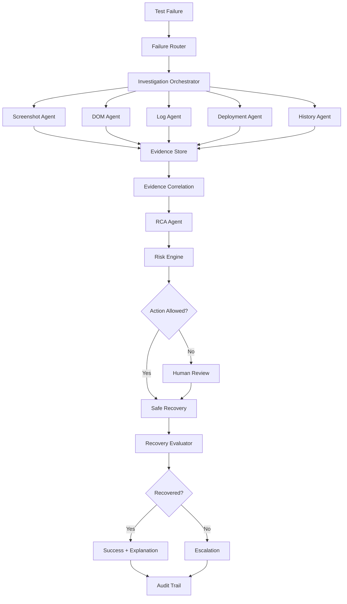

# 🤖 Agentic Self-Healing QA System V2

### Autonomous Failure Investigation • Root-Cause Analysis • Risk-Aware Self-Healing • Evidence-Driven QA

> **Detect → Classify → Investigate → Correlate → Reason → Decide → Safely Act → Validate → Explain → Escalate**

An **agentic, production-oriented AI Quality Engineering platform** designed to autonomously investigate automated test failures, identify probable root causes, select safe recovery actions, validate the result, and escalate uncertain or high-risk situations to humans.

This is **not a chatbot that summarizes test failures**.

It is an **investigation and decision engine** built around:

* 🧠 Structured failure classification
* 🔎 Parallel evidence collection
* 🤖 Specialized investigation agents
* 🧩 Evidence-grounded Root Cause Analysis
* ⚖️ Risk-aware action selection
* 🛡️ Bounded self-healing
* ✅ Independent recovery evaluation
* 👤 Human-in-the-loop approval
* 📜 Complete auditability
* 🔁 Controlled retry and recovery loops
* 📊 Explainable decisions

---

## 🌟 What Problem Does This Solve?

Modern automation frameworks can execute thousands of tests, but when failures occur, engineers still spend significant time answering:

> **What failed?**

> **Why did it fail?**

> **Is it a real product defect or a test/environment problem?**

> **Can it be safely recovered automatically?**

> **Did the recovery actually work?**

> **Should this failure be retried, healed, ignored, or escalated?**

Traditional automation usually stops at:

```text
TEST FAILED
     ↓
Generate Report
     ↓
Human Investigates
```

This platform extends that workflow into:

```text
                    ┌──────────────────────┐
                    │    Test Failure      │
                    └──────────┬───────────┘
                               ↓
                    ┌──────────────────────┐
                    │   Failure Router     │
                    │ Classification +     │
                    │ Confidence           │
                    └──────────┬───────────┘
                               ↓
                 ┌─────────────────────────────┐
                 │ Investigation Orchestrator  │
                 └──────────────┬──────────────┘
                                ↓
       ┌────────────┬───────────┼───────────┬────────────┐
       ↓            ↓           ↓           ↓            ↓
    Screenshot     DOM        Logs       Deploy      History
      Agent       Agent       Agent       Agent       Agent
       └────────────┴───────────┼───────────┴────────────┘
                                ↓
                    ┌──────────────────────┐
                    │ Evidence Correlation │
                    └──────────┬───────────┘
                               ↓
                    ┌──────────────────────┐
                    │      RCA Engine       │
                    │ Fact                  │
                    │ Observation           │
                    │ Inference             │
                    │ Hypothesis            │
                    │ Recommendation        │
                    └──────────┬───────────┘
                               ↓
                    ┌──────────────────────┐
                    │  Risk / Policy Gate  │
                    └──────────┬───────────┘
                               ↓
                ┌──────────────┴──────────────┐
                ↓                             ↓
          Safe Recovery                 Human Review
                ↓                             ↓
          Execute Action                 Approve / Reject
                └──────────────┬──────────────┘
                               ↓
                    ┌──────────────────────┐
                    │    Recovery          │
                    │    Evaluator         │
                    └──────────┬───────────┘
                               ↓
                     ┌────────┴────────┐
                     ↓                 ↓
                  SUCCESS           FAILURE
                     ↓                 ↓
                  Explain          Escalate
                     └───────┬─────────┘
                             ↓
                       Audit Trail
```

---

# 🚀 Key Capabilities

| Capability                | Description                                                              |
| ------------------------- | ------------------------------------------------------------------------ |
| 🧭 Failure Router         | Classifies failures into structured categories                           |
| 🔎 Investigation Agents   | Collect evidence from multiple technical sources                         |
| ⚡ Parallel Investigation  | Independent evidence sources execute concurrently                        |
| 🧠 RCA Engine             | Separates facts from observations, inference, and hypotheses             |
| 🔗 Evidence Correlation   | Connects evidence across DOM, logs, deployments, screenshots and history |
| ⚖️ Risk Engine            | Calculates whether an action is safe to perform                          |
| 🛡️ Self-Healing          | Performs bounded recovery actions                                        |
| 🔁 Recovery Loop          | Re-validates after every recovery attempt                                |
| ✅ Evaluator               | Determines whether recovery actually resolved the failure                |
| 👤 HITL                   | Escalates uncertain or dangerous situations                              |
| 📜 Audit Trail            | Records evidence, reasoning, actions and outcomes                        |
| 🚧 Safety Bounds          | Prevents infinite investigation/retry/healing loops                      |
| 🧪 Deterministic Mock LLM | Complete offline demonstration without API keys                          |
| 🌐 FastAPI                | Programmatic investigation API                                           |
| 🖥️ CLI                   | Developer-friendly investigation interface                               |
| 🧩 LangGraph              | Explicit stateful agent orchestration                                    |

---

# 🧠 Core Design Philosophy

The system follows one important principle:

> **An AI agent should never be trusted merely because it sounds confident.**

Every decision should be grounded in structured evidence.

Therefore the platform explicitly separates:

```text
FACT
 ↓
OBSERVATION
 ↓
INFERENCE
 ↓
HYPOTHESIS
 ↓
RECOMMENDATION
 ↓
ACTION
 ↓
VALIDATION
```

### Example

Instead of:

> "The login button locator is broken."

The system should reason:

```text
FACT
The test failed because the locator
button[data-testid="login-button"]
returned zero matching elements.

OBSERVATION
The DOM snapshot does not contain the
expected data-testid.

FACT
The deployment changed the login component
during the last release.

INFERENCE
The locator may no longer represent the
current DOM contract.

HYPOTHESIS
The failure is likely caused by UI contract
drift rather than an application outage.

RECOMMENDATION
Attempt a bounded locator recovery.

ACTION
Try approved alternative locator strategy.

VALIDATION
Re-execute the failed test.

RESULT
PASS

FINAL CLASSIFICATION
Test maintenance / locator drift.
```

This distinction makes the system significantly safer than unrestricted LLM-based automation.

---

# 🏗️ High-Level Architecture



---

# 🔄 End-to-End Investigation Lifecycle

## Phase 1 — Detect

A test execution system reports a failure.

Example:

```json
{
  "test_name": "login_with_valid_credentials",
  "framework": "playwright",
  "error_type": "locator_not_found",
  "message": "locator('button[data-testid=login-button]') not found",
  "environment": "staging"
}
```

---

## Phase 2 — Classify

The Failure Router determines:

```text
Category:
LOCATOR_FAILURE

Confidence:
0.96

Initial Severity:
MEDIUM

Potential Causes:
- DOM change
- Locator drift
- Feature regression
- Page not loaded
- Authentication/session problem
```

Supported categories can include:

```text
LOCATOR_FAILURE
TIMEOUT
ASSERTION_FAILURE
NETWORK_FAILURE
AUTHENTICATION_FAILURE
ENVIRONMENT_FAILURE
DATA_FAILURE
APPLICATION_ERROR
DEPENDENCY_FAILURE
PERFORMANCE_FAILURE
INFRASTRUCTURE_FAILURE
UNKNOWN
```

---

# 🔎 Phase 3 — Parallel Investigation

Instead of asking one LLM to reason about everything, specialized agents investigate different evidence domains.

```text
                    Investigation
                          │
          ┌───────────────┼───────────────┐
          ↓               ↓               ↓
       Browser           Logs          Deployment
          │               │               │
       ┌──┴──┐         ┌──┴──┐         ┌──┴──┐
       DOM Screenshot   App   API      Git   CI/CD
```

### Investigation Agents

| Agent              | Evidence                          |
| ------------------ | --------------------------------- |
| Browser Agent      | DOM, page state, console errors   |
| Screenshot Agent   | Visual state of the page          |
| Log Agent          | Application and test logs         |
| Network Agent      | Requests, responses, status codes |
| Deployment Agent   | Recent releases and changes       |
| History Agent      | Previous failures and resolutions |
| Environment Agent  | Browser, OS, service health       |
| Test History Agent | Flakiness and historical patterns |

---

# 🧩 Evidence Model

The system treats evidence as first-class data.

Example:

```json
{
  "source": "dom",
  "type": "fact",
  "content": "Expected data-testid was not present",
  "confidence": 0.99,
  "timestamp": "2026-08-20T12:10:00Z"
}
```

Evidence can then be correlated:

```text
DOM Evidence
     +
Git Change
     +
Historical Failure
     +
Screenshot
     +
Application Logs
     ↓
Evidence Correlation
     ↓
Root Cause Hypothesis
```

---

# 🧠 RCA Engine

The RCA engine intentionally separates reasoning layers.

### Fact

Directly observed evidence.

```text
Login button locator returned zero elements.
```

### Observation

Pattern derived from evidence.

```text
The expected test identifier is missing from the DOM.
```

### Inference

Reasonable conclusion derived from observations.

```text
The page structure may have changed.
```

### Hypothesis

Potential root cause that still requires validation.

```text
A recent frontend deployment may have changed
the login component contract.
```

### Recommendation

Proposed next action.

```text
Attempt approved locator recovery and re-run the test.
```

---

# ⚖️ Risk-Aware Decision Engine

The system does **not** allow the LLM to directly execute arbitrary tools.

Every action passes through policy and safety controls.

```text
AI Recommendation
       ↓
Action Validator
       ↓
Risk Assessment
       ↓
Policy Check
       ↓
Healing Level
       ↓
Approval Decision
```

Example:

```json
{
  "action": "refresh_session",
  "risk": "LOW",
  "healing_level": 1,
  "confidence": 0.94,
  "requires_human_approval": false
}
```

---

# 🛡️ Six Healing Levels

| Level  | Capability                               | Default      |
| ------ | ---------------------------------------- | ------------ |
| **L0** | Diagnosis only                           | ✅            |
| **L1** | Retry / wait / refresh                   | ✅            |
| **L2** | Session recovery / bounded test recovery | ✅            |
| **L3** | Test artifact modification proposal      | ❌ HITL       |
| **L4** | Broader automation changes               | ❌ HITL       |
| **L5** | Production-impacting operations          | ❌ Restricted |

### Default Philosophy

> **The system should fail safely rather than heal aggressively.**

---

# 🔁 Self-Healing Loop

Self-healing is never:

```text
Failure → AI → Fix → Done
```

Instead:

```text
Failure
  ↓
Investigate
  ↓
Recommend
  ↓
Risk Gate
  ↓
Execute
  ↓
Re-run
  ↓
Evaluate
  ↓
┌───────────────┐
│ Did it work?  │
└───────┬───────┘
        │
    ┌───┴───┐
    ↓       ↓
   YES      NO
    ↓       ↓
 Success   Re-investigate
            ↓
          Bounds
            ↓
        Escalation
```

---

# ✅ Recovery Evaluator

A recovery action is considered successful only when validation proves it.

The evaluator checks:

### Original Failure

```text
Did the original failure disappear?
```

### Regression Detection

```text
Did the recovery introduce another failure?
```

### Test Result

```text
PASS / FAIL / UNKNOWN
```

### Confidence

```text
0.00 → 1.00
```

### Final Decision

```text
RECOVERED
NOT_RECOVERED
PARTIALLY_RECOVERED
ESCALATE
```

---

# 🚧 Safety Bounds

Autonomous systems require hard limits.

The platform includes bounded controls such as:

```text
MAX_INVESTIGATION_DEPTH
MAX_AGENT_CALLS
MAX_RECOVERY_ATTEMPTS
MAX_RETRIES
MAX_TOOL_EXECUTION_TIME
MAX_HEALING_LEVEL
MAX_TOTAL_EXECUTION_TIME
```

Example:

```python
MAX_RECOVERY_ATTEMPTS = 2
MAX_INVESTIGATION_DEPTH = 5
MAX_RETRIES = 2
```

This prevents:

```text
Agent → Tool → Agent → Tool → Agent → Tool → ...
```

from becoming an infinite loop.

---

# 👤 Human-in-the-Loop

Humans remain the final authority for risky operations.

The system automatically escalates when:

* Confidence is too low
* Evidence conflicts
* Risk exceeds policy
* Healing level is restricted
* Multiple recovery attempts fail
* Production-impacting action is suggested
* Root cause cannot be established
* Validation produces ambiguous results

Example:

```text
┌────────────────────────────────────────┐
│         HUMAN APPROVAL REQUIRED        │
├────────────────────────────────────────┤
│                                        │
│ Proposed Action:                       │
│ Update locator strategy                │
│                                        │
│ Confidence: 0.81                       │
│ Risk: MEDIUM                           │
│ Healing Level: L3                      │
│                                        │
│ Evidence:                              │
│ • DOM changed                          │
│ • Recent frontend deployment            │
│ • Historical locator failures           │
│                                        │
│ [ APPROVE ]       [ REJECT ]           │
└────────────────────────────────────────┘
```

---

# 📜 Auditability

Every investigation should be reproducible.

The audit trail can capture:

```text
Investigation ID
│
├── Failure Input
├── Classification
├── Classification Confidence
├── Evidence Sources
├── Agent Decisions
├── Tool Calls
├── RCA
├── Risk Assessment
├── Proposed Action
├── Approval
├── Recovery Attempt
├── Validation Result
├── Final Decision
└── Explanation
```

This enables:

* Debugging
* Compliance
* Model evaluation
* Human review
* Reproducibility
* Continuous improvement

---

# 🧬 Investigation State

The LangGraph state contains the complete investigation context.

Conceptually:

```python
InvestigationState
│
├── failure
├── classification
├── evidence
├── investigation_results
├── rca
├── action_candidates
├── selected_action
├── risk_assessment
├── recovery_attempts
├── evaluation
├── escalation
└── audit
```

This allows every node to operate on a shared, structured state rather than passing unstructured text between agents.

---

# 🕸️ Why LangGraph?

The platform uses LangGraph because the workflow requires:

* Stateful execution
* Conditional routing
* Parallel agent execution
* Durable workflow state
* Controlled loops
* Human-in-the-loop interrupts
* Explicit graph transitions
* Recovery branches
* Failure handling

The workflow is intentionally represented as a graph rather than a single autonomous agent.

```text
START
  ↓
CLASSIFY
  ↓
INVESTIGATE
  ↓
CORRELATE
  ↓
RCA
  ↓
RISK CHECK
  ↓
ACTION
  ↓
VALIDATE
  ↓
┌──────────────┐
│   SUCCESS?   │
└──────┬───────┘
       │
   ┌───┴───┐
   ↓       ↓
 SUCCESS   FAILURE
   ↓       ↓
 EXPLAIN  BOUNDS?
           │
       ┌───┴───┐
       ↓       ↓
      YES      NO
       ↓       ↓
    RETRY    ESCALATE
```

---

# 🧱 Project Structure

```text
agentic-self-healing-qa/
│
├── src/
│   │
│   ├── models/
│   │   └── schemas.py
│   │       # Pydantic domain models
│   │
│   ├── state.py
│   │   # LangGraph investigation state
│   │
│   ├── config.py
│   │   # Configuration and safety bounds
│   │
│   ├── services/
│   │   └── llm.py
│   │       # LLM provider abstraction
│   │       # Deterministic mock provider
│   │
│   ├── tools/
│   │   ├── screenshot.py
│   │   ├── dom.py
│   │   ├── logs.py
│   │   ├── deployment.py
│   │   └── history.py
│   │
│   ├── graph/
│   │   ├── nodes.py
│   │   │   # Workflow nodes
│   │   │
│   │   └── workflow.py
│   │       # LangGraph definition
│   │
│   ├── api/
│   │   └── main.py
│   │       # FastAPI endpoints
│   │
│   └── cli.py
│       # CLI interface
│
├── tests/
│   ├── test_router.py
│   ├── test_rca.py
│   ├── test_safety.py
│   ├── test_recovery.py
│   └── test_workflow.py
│
├── docs/
│   ├── architecture.md
│   ├── safety.md
│   ├── agents.md
│   └── evaluation.md
│
├── diagrams/
│   ├── architecture.mmd
│   ├── workflow.mmd
│   └── healing-loop.mmd
│
├── pyproject.toml
├── README.md
└── LICENSE
```

---

# ⚡ Quick Start

## 1. Clone

```bash
git clone <your-repository-url>
cd agentic-self-healing-qa
```

## 2. Create Virtual Environment

### Linux / macOS

```bash
python -m venv .venv
source .venv/bin/activate
```

### Windows

```powershell
python -m venv .venv
.venv\Scripts\activate
```

## 3. Install

```bash
pip install -e .
```

## 4. Run Offline Demo

```bash
python -m src.cli demo
```

The demo executes multiple realistic failure scenarios using the deterministic mock LLM.

### No API key required.

---

# 🧪 Example Scenarios

The offline demo can simulate failures such as:

### Scenario 1 — Locator Drift

```text
Failure
  ↓
Locator missing
  ↓
DOM investigation
  ↓
Deployment correlation
  ↓
RCA: UI contract drift
  ↓
Safe locator recovery
  ↓
Re-run
  ↓
PASS
```

### Scenario 2 — Authentication / Session Failure

```text
Failure
  ↓
401 / expired session
  ↓
Log + network investigation
  ↓
Session evidence
  ↓
Risk assessment
  ↓
Refresh session
  ↓
Re-run
  ↓
PASS
```

### Scenario 3 — Real Application Defect

```text
Failure
  ↓
Application error
  ↓
Logs + network + deployment
  ↓
Evidence correlation
  ↓
High-confidence product defect
  ↓
No automatic healing
  ↓
Escalate
```

---

# 🔍 Investigate a Custom Failure

```bash
python -m src.cli investigate \
  -m "locator 'button[data-testid=login-button]' not found"
```

Example conceptual output:

```text
╭──────────────────────────────────────────────╮
│           AGENTIC QA INVESTIGATION            │
╰──────────────────────────────────────────────╯

Failure:
locator 'button[data-testid=login-button]' not found

Classification:
LOCATOR_FAILURE

Confidence:
96%

Evidence:
✓ DOM snapshot
✓ Screenshot
✓ Deployment history
✓ Previous test failures
✓ Test execution logs

Root Cause:
Likely UI contract drift.

Risk:
LOW

Recommended Action:
Attempt bounded locator recovery.

Healing Level:
L1

Action:
APPROVED

Validation:
PASSED

Final Decision:
RECOVERED
```

---

# 🌐 Start the API

```bash
uvicorn src.api.main:app --reload --port 8000
```

API:

```text
http://localhost:8000
```

Swagger:

```text
http://localhost:8000/docs
```

---

# 📡 Investigation API

### Endpoint

```http
POST /api/v1/investigate
```

Example:

```json
{
  "test_name": "login_with_valid_credentials",
  "framework": "playwright",
  "error_message": "locator('button[data-testid=login-button]') not found",
  "environment": "staging"
}
```

Example response:

```json
{
  "investigation_id": "inv_8f72a1",
  "classification": {
    "category": "LOCATOR_FAILURE",
    "confidence": 0.96
  },
  "rca": {
    "root_cause": "UI contract drift",
    "confidence": 0.89
  },
  "action": {
    "type": "SAFE_RECOVERY",
    "healing_level": 1,
    "risk": "LOW"
  },
  "evaluation": {
    "status": "RECOVERED"
  }
}
```

---

# 🔌 LLM Provider Architecture

The LLM layer is abstracted behind a provider interface.

```text
                 LLM Provider
                      │
       ┌──────────────┼──────────────┐
       ↓              ↓              ↓
   Mock LLM       Provider A      Provider B
       │
   Offline
   Testing
```

This allows the platform to support different providers without changing the orchestration layer.

Benefits:

* Provider independence
* Easy testing
* Offline development
* Deterministic CI
* Model benchmarking
* Cost control

---

# 🧪 Deterministic Mock LLM

The project includes a high-quality deterministic mock provider.

This is important because agentic systems should be testable without depending on:

```text
Internet
API Keys
Model Availability
Rate Limits
Provider Outages
LLM Cost
```

Therefore:

```text
CI Pipeline
     ↓
Mock LLM
     ↓
Deterministic Workflow
     ↓
Predictable Assertions
```

The mock provider makes it possible to test the **agent architecture**, not just the model.

---

# 🧪 Testing Strategy

The platform should be tested at multiple levels.

## Unit Tests

Test individual components:

```text
Failure Router
RCA Parser
Risk Engine
Action Validator
Safety Bounds
Recovery Evaluator
```

## Integration Tests

Validate:

```text
Router → Investigation → RCA → Action
```

## Graph Tests

Validate:

```text
Conditional edges
Parallel branches
Recovery loops
Escalation paths
HITL transitions
```

## Safety Tests

Ensure:

```text
Level 3+ cannot execute automatically
Recovery attempts cannot exceed limits
Unauthorized tools cannot be called
Production tools remain disabled
```

---

# 📊 Evaluation Framework

An autonomous QA system needs more than traditional unit tests.

Evaluation should measure:

| Metric                  | Meaning                                |
| ----------------------- | -------------------------------------- |
| Classification Accuracy | Correct failure category               |
| RCA Accuracy            | Correct root cause                     |
| Evidence Precision      | Relevant evidence selected             |
| Evidence Recall         | Important evidence discovered          |
| Recovery Success Rate   | Failures successfully recovered        |
| False Healing Rate      | Incorrect fixes applied                |
| Escalation Accuracy     | Correct human escalation               |
| Mean Investigation Time | Time to diagnosis                      |
| Mean Recovery Time      | Time to recovery                       |
| Confidence Calibration  | Whether confidence matches correctness |
| Tool Efficiency         | Number of tool calls                   |
| Cost per Investigation  | LLM/tool cost                          |
| Regression Rate         | New failures caused by healing         |

---

# 🎯 Golden Dataset

A mature implementation should maintain a labeled failure dataset:

```text
failure-dataset/
│
├── locator/
├── timeout/
├── network/
├── auth/
├── data/
├── environment/
├── deployment/
├── application/
└── infrastructure/
```

Each sample should contain:

```json
{
  "failure": "...",
  "expected_category": "...",
  "expected_root_cause": "...",
  "expected_action": "...",
  "expected_risk": "...",
  "expected_outcome": "..."
}
```

This allows continuous evaluation of agent behavior.

---

# 🧠 Memory & Historical Intelligence

Future versions can maintain historical knowledge.

```text
Current Failure
      ↓
Similarity Search
      ↓
Previous Failures
      ↓
Previous RCA
      ↓
Previous Successful Recovery
      ↓
Current Investigation
```

Potential storage:

```text
PostgreSQL
+
pgvector
+
Object Storage
```

Historical memory can answer:

> "Have we seen this failure before?"

and:

> "What fixed it last time?"

---

# 📈 Observability

Production deployments should expose:

```text
Investigation Duration
Agent Latency
LLM Latency
Tool Latency
Token Usage
Recovery Attempts
Escalations
RCA Confidence
Action Risk
Recovery Success
Failure Categories
```

Recommended observability stack:

```text
OpenTelemetry
      ↓
Metrics + Traces + Logs
      ↓
Prometheus / Grafana
```

Each investigation should have a correlation ID:

```text
INV-2026-08-20-8F72A1
```

which follows the entire lifecycle.

---

# 🔐 Security Principles

The platform follows a least-privilege architecture.

### Agents should not automatically receive:

```text
Production credentials
Database write access
Deployment permissions
Secrets
Infrastructure administration
```

Instead:

```text
Agent
 ↓
Tool Request
 ↓
Permission Check
 ↓
Policy Engine
 ↓
Execution
```

Sensitive information should also be:

* Redacted
* Masked
* Access-controlled
* Audited

---

# 🛡️ Production Safety Model

The system is designed around **bounded autonomy**.

```text
                 AUTONOMY
                    ↑
                    │
        ┌───────────┼───────────┐
        │           │           │
      L0/L1        L2         L3+
        │           │           │
     Observe     Recover      HITL
        │           │           │
        └───────────┴───────────┘
                    ↓
               Safety Gate
```

The goal is not:

> **Maximum autonomy**

The goal is:

> **Maximum useful autonomy within explicit safety boundaries.**

---

# 🚀 Roadmap

## Phase 1 — Foundation

* [x] Structured failure models
* [x] Failure classification
* [x] Investigation state
* [x] LangGraph workflow
* [x] Deterministic mock LLM
* [x] CLI
* [x] FastAPI
* [x] Safety bounds
* [x] Basic RCA
* [x] Recovery evaluation

## Phase 2 — Real Browser Intelligence

* [ ] Playwright integration
* [ ] Live DOM extraction
* [ ] Screenshot capture
* [ ] Browser console analysis
* [ ] Network inspection
* [ ] Trace analysis
* [ ] Video evidence

## Phase 3 — Historical Intelligence

* [ ] PostgreSQL persistence
* [ ] pgvector memory
* [ ] Failure similarity search
* [ ] Historical RCA retrieval
* [ ] Recovery knowledge base

## Phase 4 — Enterprise Observability

* [ ] OpenTelemetry
* [ ] Prometheus metrics
* [ ] Grafana dashboards
* [ ] Distributed tracing
* [ ] Investigation analytics

## Phase 5 — Human Review Platform

* [ ] Next.js dashboard
* [ ] Evidence viewer
* [ ] RCA explorer
* [ ] Approval workflow
* [ ] Recovery history
* [ ] Audit explorer

## Phase 6 — Autonomous Quality Engineering

* [ ] Predictive test selection
* [ ] Flaky test detection
* [ ] Failure clustering
* [ ] Release risk scoring
* [ ] Autonomous regression analysis
* [ ] Test maintenance recommendations
* [ ] CI/CD decision engine

---

# 🏢 Enterprise Vision

The long-term vision is to evolve this project into an **AI Quality Engineering Control Plane**.

```text
                 ┌─────────────────────────┐
                 │    QA Control Plane     │
                 └────────────┬────────────┘
                              │
        ┌─────────────────────┼─────────────────────┐
        ↓                     ↓                     ↓
 Test Intelligence       Failure Intelligence   Release Intelligence
        │                     │                     │
        ↓                     ↓                     ↓
 Test Generation          RCA Engine           Risk Engine
        │                     │                     │
        ↓                     ↓                     ↓
 Self-Healing             Recovery             CI/CD Decision
```

The platform can eventually integrate with:

```text
Playwright
Selenium
Cypress
Appium
Pytest
JUnit
Cucumber
Jenkins
GitHub Actions
Azure DevOps
GitLab CI
AWS
Azure
GCP
Kubernetes
```

---

# 💡 What Makes This Different?

Most AI QA tools focus on:

```text
Generate Test
     ↓
Execute Test
     ↓
Generate Report
```

This project focuses on:

```text
Failure
  ↓
Understand
  ↓
Investigate
  ↓
Correlate Evidence
  ↓
Determine Root Cause
  ↓
Assess Risk
  ↓
Take Bounded Action
  ↓
Validate
  ↓
Learn
  ↓
Escalate When Necessary
```

The core idea is:

> **Don't just explain the failure. Investigate it, make a controlled decision, verify the result, and know when not to act.**

---

# 📸 Screenshots

## 🔎 Failure Classification & Investigation


---

## 🧠 Evidence-Grounded RCA


---

## ⚖️ Risk-Aware Action Selection


---

## 🛡️ Safe Recovery


---

## 📊 Investigation & Evaluation


---

# 📚 Documentation

For a deeper technical explanation, see:

```text
docs/
├── architecture.md
├── agents.md
├── safety.md
├── evaluation.md
└── deployment.md
```

Recommended documentation hierarchy:

```text
README
  ↓
Architecture
  ↓
Agent Design
  ↓
State Model
  ↓
Safety Model
  ↓
Evaluation
  ↓
Deployment
```

---

# 🤝 Contributing

Contributions are welcome.

Potential areas:

* New investigation agents
* New failure classifiers
* Browser integrations
* Recovery strategies
* Evaluation datasets
* Observability integrations
* CI/CD integrations
* Safety policies
* Vector memory
* Dashboard development

### Contribution Flow

```bash
git checkout -b feature/my-improvement

git add .

git commit -m "feat: add investigation capability"

git push origin feature/my-improvement
```

Then open a Pull Request.

---

# 🧭 Design Principles

This project follows several principles:

### 1. Evidence before action

```text
No evidence → No autonomous action
```

### 2. Bounded autonomy

```text
More autonomy ≠ Better system
```

### 3. Validation is mandatory

```text
Action ≠ Success
```

Only validation can establish recovery.

### 4. Human authority

```text
AI recommends.
Policy decides.
Human controls high-risk actions.
```

### 5. Structured state

Avoid passing everything as free-form text.

Use explicit schemas.

### 6. Explainability

Every important decision should answer:

```text
What happened?
What evidence supports it?
What do we believe?
How confident are we?
What action was selected?
Why was it safe?
Did it work?
```

---

# 🏆 Portfolio Value

This project demonstrates practical experience across:

```text
AI Agents
        +
LLM Engineering
        +
LangGraph
        +
Python
        +
Pydantic
        +
FastAPI
        +
Playwright
        +
Test Automation
        +
Root Cause Analysis
        +
RAG / Memory
        +
Observability
        +
CI/CD
        +
AI Safety
        +
Human-in-the-Loop
```

It is intentionally designed as a **production architecture exercise**, not simply an LLM wrapper.

---

# 📄 License

MIT License.

See [`LICENSE`](LICENSE) for details.

---

# 👨‍💻 Author

## Upadrasta Harsha Vardhan

**AI Automation Engineer • QA Engineer • Agentic AI Builder**

Focused on building intelligent systems that combine:

> **Software Testing + Automation + AI Agents + LLMs + Autonomous Quality Engineering**

---

# ⭐ If You Find This Useful

If this project helped you understand **agentic failure investigation, self-healing automation, LangGraph orchestration, or AI-powered Quality Engineering**, consider giving the repository a ⭐.

---

<div align="center">

### 🤖 Agentic Self-Healing QA System

**Don't just detect failures. Understand them.**

**Don't just suggest fixes. Validate them.**

**Don't automate blindly. Automate safely.**

<br>

**Detect → Investigate → Reason → Decide → Heal → Validate → Explain → Escalate**

</div>
