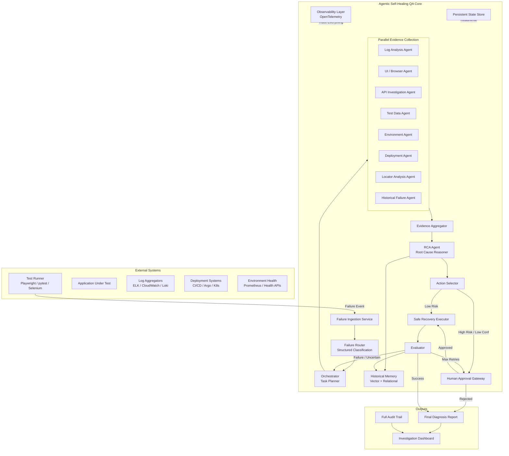
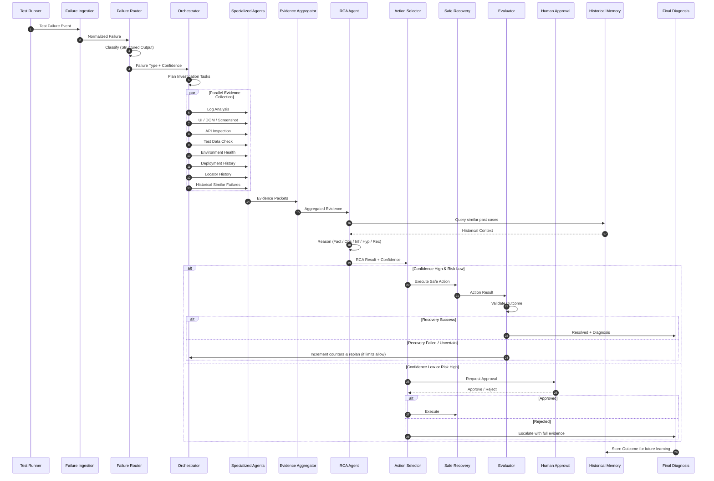
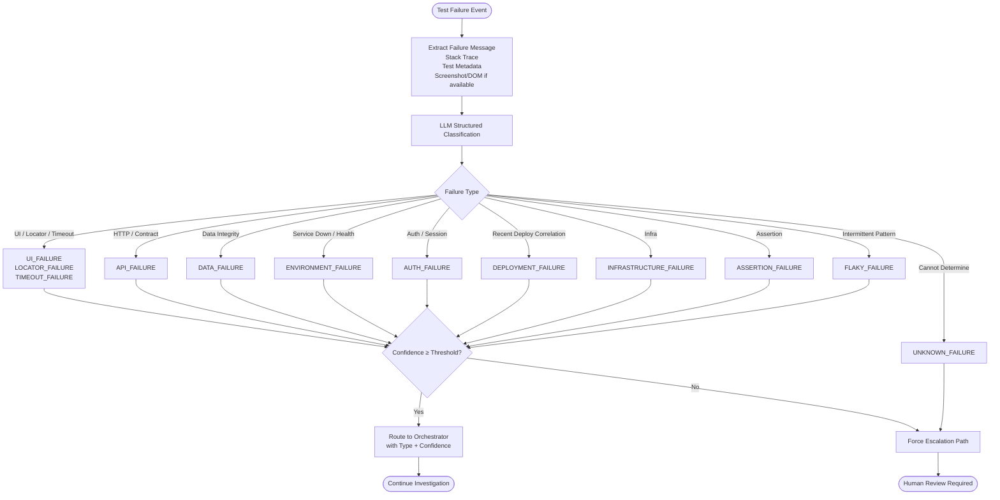
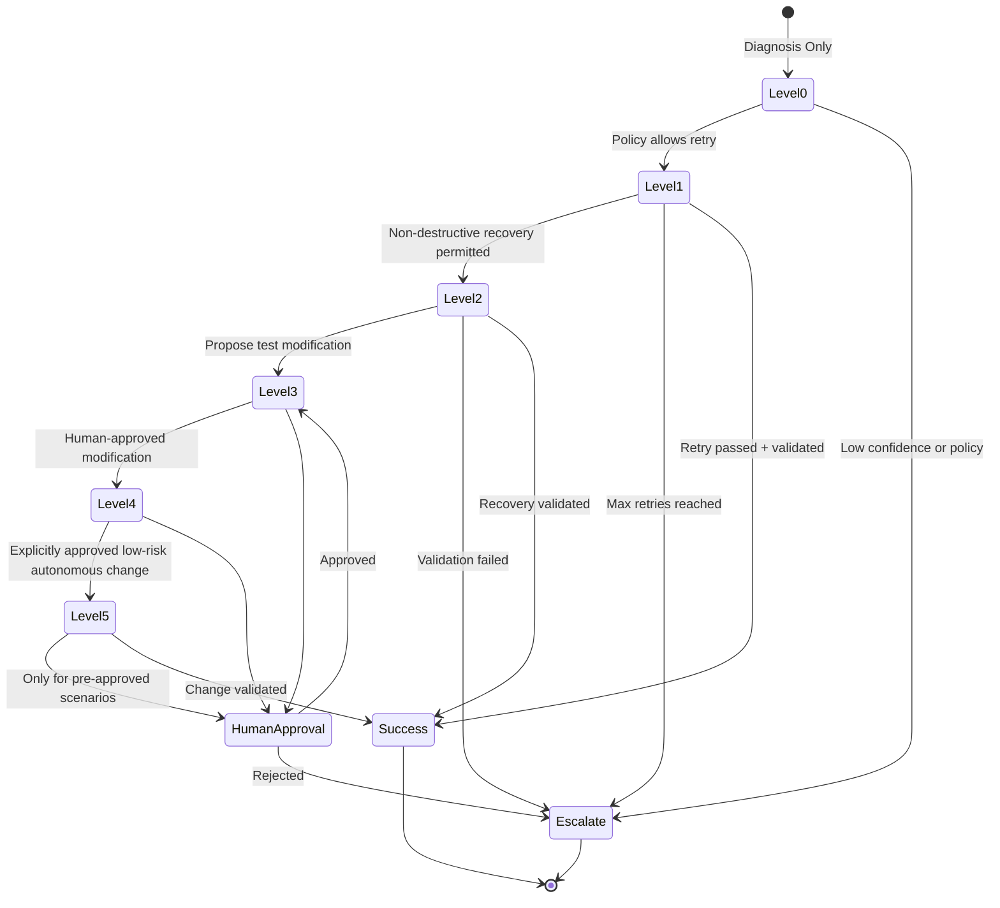
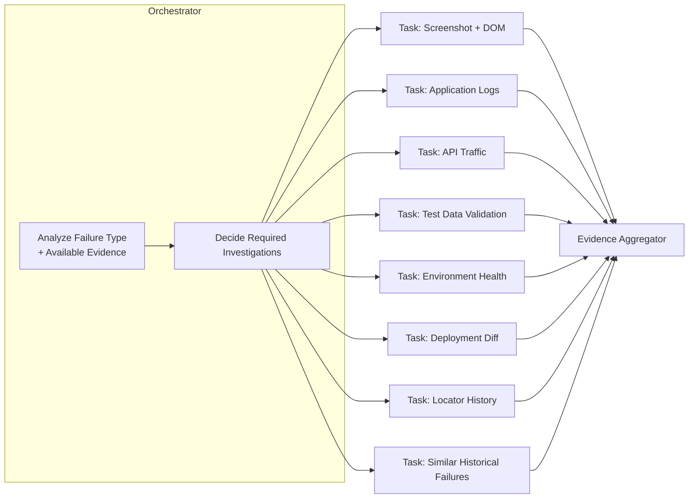
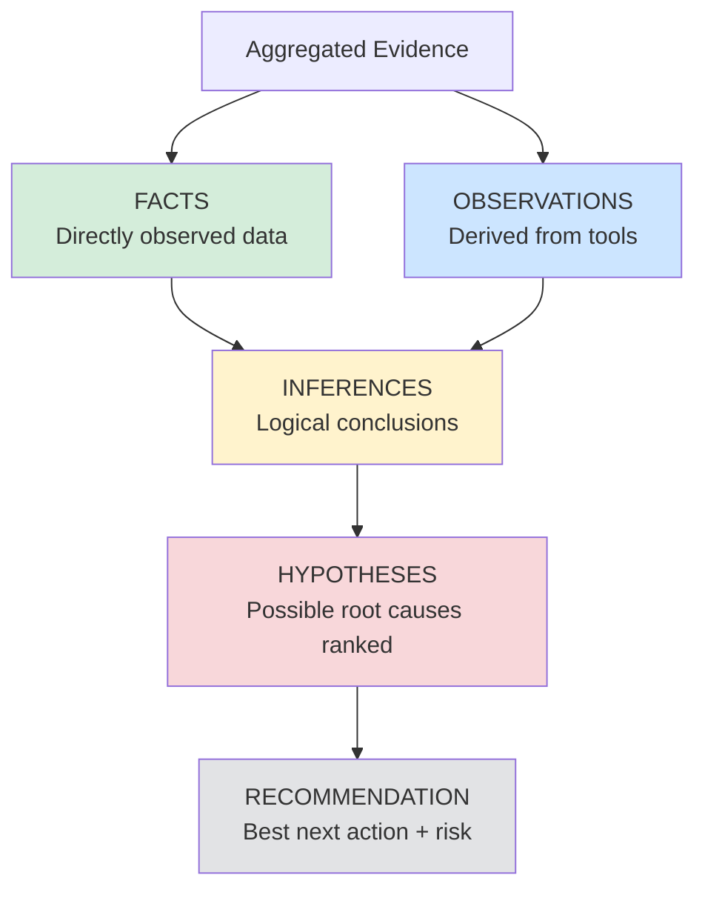
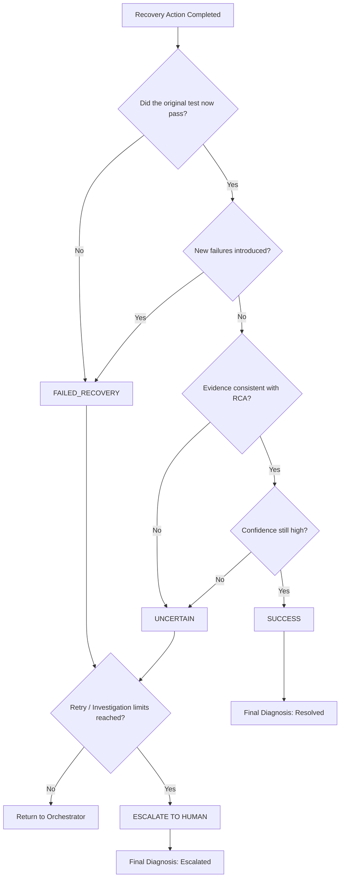
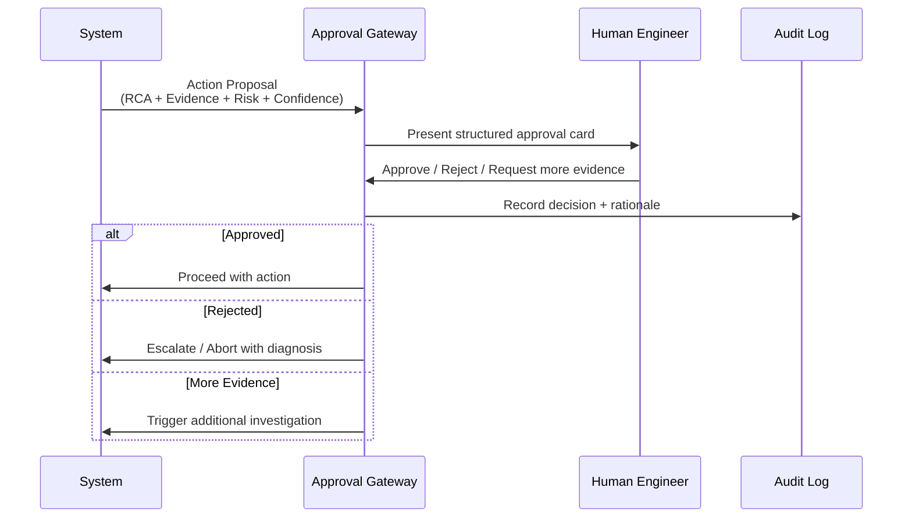

# 1. Executive Summary

## Agentic Self-Healing QA System with Autonomous Root-Cause Analysis

**Document Type:** High-Level Design (HLD)  
**Version:** 1.0  
**Date:** August 20, 2026  
**Classification:** Internal / Portfolio / Enterprise-Ready Design  
**Authors:** Principal AI Architect, QA Automation Architect, Agentic AI Engineer

---

### Vision Statement

> Build an AI-powered QA engineering system that can **autonomously investigate test failures**, reason over multi-source evidence, identify probable root causes with high explainability, safely attempt bounded recovery actions, validate the outcome, and produce a transparent diagnosis with a complete evidence trail — while keeping humans in control of high-risk decisions.

### Core Value Proposition

The system transforms the traditional “Test → Fail → Human Investigation” loop into:

**Detect → Investigate → Reason → Decide → Safely Act → Validate → Explain → Escalate (when necessary)**

It is **not** a magic auto-fixer. It is a production-grade investigation and decision-support platform with carefully bounded autonomy.

### Key Design Principles

| Principle                  | Description                                                                 |
|---------------------------|-----------------------------------------------------------------------------|
| Bounded Autonomy          | Agents operate only within explicitly defined risk levels and retry limits |
| Deterministic First       | Use explicit workflows when the path is predictable                         |
| Agentic Only When Needed  | Dynamic reasoning only when next action cannot be predetermined             |
| Explainability First      | Every conclusion must be backed by evidence and distinguishable as Fact / Observation / Inference / Hypothesis / Recommendation |
| Least Privilege           | No agent has unrestricted tool access                                       |
| Observability by Design   | Every decision, tool call, and state change is fully traceable              |
| Human-in-the-Loop         | High-risk or low-confidence actions always escalate                         |
| Safety over Completeness  | Prefer clean escalation over incorrect autonomous action                    |

### What This System Delivers

- Dramatic reduction in manual failure investigation time
- Consistent, evidence-grounded Root Cause Analysis
- Safe, bounded self-healing for known recoverable failure classes
- Complete audit trail for every diagnosis and recovery attempt
- Historical knowledge reuse across failures
- Clear escalation path when autonomy is insufficient

### Out of Scope (MVP)

- Autonomous modification of production application code
- Unrestricted test script rewriting
- Fully autonomous infrastructure changes
- Handling of every possible failure class in the first release

---

**This document provides the complete high-level design required to implement a production-oriented, portfolio-grade Agentic Self-Healing QA platform.**
# 2. Problem Statement & Motivation

## 2.1 The Fundamental QA Problem

Traditional automated QA systems follow a linear, passive model:

```
Test Execution → Pass / Fail → Report
```

When a test fails, the system stops. A human engineer is then forced to perform a multi-step forensic investigation that typically includes:

- Inspecting test logs and stack traces
- Examining screenshots and browser traces (Playwright / Selenium)
- Analyzing DOM structure and locators
- Checking API request/response payloads and status codes
- Validating test data integrity
- Reviewing application and infrastructure logs
- Comparing recent deployments and configuration changes
- Checking environment health and service status
- Determining whether the failure is real, transient (flaky), or environmental
- Identifying whether the root cause lies in the test, application, data, or infrastructure
- Deciding on a remediation action
- Retrying the test
- Documenting the findings

This process is **manual, repetitive, time-consuming, and poorly reusable**.

## 2.2 Why the Problem Matters

| Impact Area                    | Consequence                                              |
|--------------------------------|----------------------------------------------------------|
| Engineering Productivity       | High percentage of QA/SDET time spent on triage          |
| Feedback Latency               | Developers wait hours/days for actionable failure insight|
| Trust in Automation            | Flaky tests erode confidence in the suite                |
| Knowledge Loss                 | Same failures are re-investigated repeatedly             |
| Release Velocity               | Investigation bottlenecks delay releases                 |
| Cost                           | Manual effort scales poorly with test volume             |
| Observability                  | Root causes remain opaque and undocumented               |

## 2.3 Who Experiences the Pain

- **Senior QA Automation Engineers / SDETs** (Primary) — spend significant daily time on failure triage
- Automation Engineers
- Developers receiving late or incomplete failure information
- DevOps / Platform Engineers dealing with environment-related noise
- QA Leads and Engineering Managers tracking investigation cost and flaky rates
- Release Managers facing delayed go/no-go decisions

## 2.4 Why Existing Approaches Are Insufficient

| Approach                          | Limitation                                              |
|-----------------------------------|---------------------------------------------------------|
| Basic test reports                | Only show symptoms, not root cause                      |
| Screenshot + video capture        | Still requires human interpretation                     |
| Simple retry mechanisms           | Do not distinguish transient from real failures         |
| Static failure classification     | Cannot handle novel or multi-cause failures             |
| Traditional monitoring dashboards | Lack test-context awareness and RCA reasoning           |
| Generic LLM chatbots              | No structured evidence collection, no safety bounds, no audit trail |

## 2.5 What This System Automates

1. Failure detection and structured classification
2. Parallel multi-source evidence collection
3. Evidence-grounded root-cause reasoning
4. Bounded, safe recovery actions
5. Outcome validation
6. Transparent diagnosis generation
7. Historical pattern recognition and knowledge reuse

## 2.6 What Remains Under Human Control

- Approval of any Level 3+ actions (test modification, production data changes, infrastructure changes)
- Final acceptance of RCA when confidence is medium/low
- Policy decisions on risk levels and recovery permissions
- Review of novel or conflicting evidence cases
- Continuous improvement of the knowledge base and evaluation datasets
# 3. Project Vision, Goals & Design Philosophy

## 3.1 Project Vision

**Build an intelligent QA engineering platform that can autonomously investigate real-world automated test failures, gather and reason over multi-source evidence, determine the most probable root cause with explicit confidence and supporting facts, safely attempt recovery within strict bounds, validate whether the recovery succeeded, and produce a complete, explainable diagnosis — while escalating cleanly whenever confidence is insufficient or risk is too high.**

## 3.2 Guiding Philosophy

> “Use explicit workflows when the process is predictable.  
> Use agentic autonomy only when the next action is unpredictable and dynamic reasoning provides real value.”

Autonomy is treated as a scarce and expensive resource. The system is designed so that the majority of the flow is deterministic and observable. Agents are invoked only at decision points that genuinely require open-ended investigation or synthesis of conflicting evidence.

## 3.3 Primary Goals

1. **Dramatically reduce Mean Time To Diagnose (MTTD)** for supported failure classes.
2. **Provide consistent, evidence-backed Root Cause Analysis**.
3. **Enable safe, bounded self-healing** for well-understood recoverable failures.
4. **Guarantee full explainability and auditability** of every decision.
5. **Preserve human control** over high-risk or low-confidence paths.
6. **Accumulate reusable organizational knowledge** about failures and resolutions.
7. **Remain production-safe** under tool failures, model hallucinations, and conflicting evidence.

## 3.4 Non-Goals (Explicit)

- Magically fixing every possible test failure
- Unrestricted autonomous code or infrastructure modification
- Replacing human judgment on novel or high-stakes failures
- Achieving 100% autonomous recovery rate
- Treating LLM confidence scores as ground truth

## 3.5 Success Definition (High-Level)

The system is successful when a Senior QA Automation Engineer can answer the following question with high confidence after reviewing the system’s output:

> “Can this AI system investigate a real-world automated test failure, gather evidence from multiple sources, reason about the probable root cause, safely choose a recovery action, validate whether the recovery worked, and explain exactly why it made that decision?”

If the answer is “Yes, and I can audit every step,” the design has succeeded.
# 4. High-Level Architecture

## 4.1 Conceptual Architecture



## 4.2 Layered View

| Layer                  | Responsibility                                                                 | Key Technologies                  |
|------------------------|--------------------------------------------------------------------------------|-----------------------------------|
| Ingestion              | Receive and normalize test failure events                                      | FastAPI, Event schemas            |
| Classification         | Structured failure typing with confidence                                      | LLM + Structured Output           |
| Orchestration          | Decide which investigation tasks are needed                                    | LangGraph Orchestrator            |
| Investigation          | Parallel specialized evidence collection                                       | Specialized Agents + Tools        |
| Reasoning              | Multi-evidence RCA with Fact/Observation/Inference separation                  | RCA Agent                         |
| Decision               | Select recovery action based on risk, confidence, and policy                   | Action Selector                   |
| Execution              | Perform only permitted recovery actions                                        | Safe Recovery Executor            |
| Validation             | Determine if recovery succeeded and original failure is resolved               | Evaluator                         |
| Knowledge              | Store and retrieve historical failures & resolutions                           | PostgreSQL + pgvector             |
| Control                | Human approval, bounds enforcement, escalation                                 | HITL Gateway + Policy Engine      |
| Observability          | Full tracing, metrics, cost, confidence tracking                               | OpenTelemetry                     |

## 4.3 Key Architectural Decisions

1. **LangGraph as the orchestration backbone** — provides explicit graph structure, persistent state, checkpointing, and human-in-the-loop interrupts.
2. **Specialized agents with least-privilege tools** — no single agent has access to all tools.
3. **Structured outputs everywhere critical** — routing, RCA, action proposals never rely on free-form text alone.
4. **Evidence-first design** — RCA is forbidden from making unsupported claims.
5. **Bounded loops by construction** — investigation depth, retries, and recovery attempts are hard limits in state.
6. **Separation of Diagnosis and Action** — the system can always stop at diagnosis if recovery risk is unacceptable.
# 5. Core Workflows & Advanced Flow Diagrams

## 5.1 End-to-End Investigation Flow (Primary Sequence)



## 5.2 Failure Router Decision Flow



## 5.3 Self-Healing Levels (Safety State Machine)



**Level Definitions**

| Level | Name                          | Autonomy                          | Typical Actions                              | Risk     |
|-------|-------------------------------|-----------------------------------|----------------------------------------------|----------|
| 0     | Diagnosis Only                | None                              | Produce RCA + evidence report                | None     |
| 1     | Safe Retry                    | Fully autonomous                  | Retry test, wait-and-retry                   | Very Low |
| 2     | Non-destructive Recovery      | Fully autonomous (bounded)        | Refresh session, re-fetch test data, clear cache | Low  |
| 3     | Propose Test Modification     | Proposal only                     | Suggest new locator / assertion change       | Medium   |
| 4     | Human-Approved Modification   | Requires explicit approval        | Apply locator update, data fix               | Medium-High |
| 5     | Fully Autonomous (Restricted) | Only pre-approved low-risk cases  | Explicitly allowed auto-fixes                | Controlled |

## 5.4 Orchestrator Parallel Task Planning



## 5.5 RCA Reasoning Structure (Mandatory Separation)



The RCA Agent is **forbidden** from presenting an Inference or Hypothesis as a Fact.

## 5.6 Evaluator Decision Flow



## 5.7 Human-in-the-Loop Approval Flow


# 6. Specialized Agents & Tool Ecosystem

## 6.1 Agent Design Principles

- Each agent has a **narrow responsibility**.
- Each agent receives **only the tools it needs** (least privilege).
- All agent outputs are **structured** (Pydantic / JSON Schema).
- Every agent returns a **confidence score**.
- Agents never perform recovery actions themselves — they only investigate and report.
- Agents handle their own tool failures gracefully and report partial evidence.

## 6.2 Specialized Investigation Agents

| Agent                        | Responsibility                                      | Allowed Tools                                      | Output Schema Highlights                  |
|-----------------------------|-----------------------------------------------------|----------------------------------------------------|-------------------------------------------|
| Log Analysis Agent          | Extract relevant errors, timestamps, correlation IDs | Application logs, test logs, infrastructure logs   | error_signatures, timestamps, severity    |
| UI / Browser Agent          | Analyze visual and DOM state                        | Screenshot, DOM snapshot, browser trace, console   | missing_elements, locator_candidates, visual_diff |
| API Investigation Agent     | Inspect request/response and contract violations    | API traffic capture, response validation           | status_codes, payload_diffs, latency      |
| Test Data Agent             | Validate and optionally refresh test data           | Data store queries, data generation helpers        | data_integrity, missing_records           |
| Environment Agent           | Assess infrastructure and service health            | Health endpoints, Prometheus, K8s status           | service_status, resource_pressure         |
| Deployment Agent            | Correlate failures with recent changes              | Deployment history, version diffs, changelogs      | recent_deploys, changed_components        |
| Locator Analysis Agent      | Detect and propose locator updates                  | DOM, locator history, previous successful locators | candidate_locators, stability_score       |
| Historical Failure Agent    | Retrieve similar past failures and resolutions      | Vector search + relational history                 | similar_cases, past_rca, past_resolution  |

## 6.3 RCA Agent (Core Reasoning Engine)

**Input:** Aggregated evidence packets + historical context  
**Output (Structured):**

```json
{
  "facts": [],
  "observations": [],
  "inferences": [],
  "hypotheses": [
    {
      "root_cause": "...",
      "confidence": 0.0-1.0,
      "supporting_evidence_ids": [],
      "contradicting_evidence_ids": []
    }
  ],
  "selected_root_cause": "...",
  "overall_confidence": 0.0-1.0,
  "recommendation": {
    "action": "...",
    "risk_level": "LOW|MEDIUM|HIGH",
    "rationale": "..."
  }
}
```

The RCA Agent is strictly prohibited from inventing evidence.

## 6.4 Tool Catalog (Summary)

| Tool Name                  | Purpose                              | Risk Level | Permission Required      | Failure Mode                     |
|---------------------------|--------------------------------------|------------|--------------------------|----------------------------------|
| take_screenshot           | Capture current UI state             | Low        | Browser context          | Return empty + error flag        |
| get_dom_snapshot          | Full or filtered DOM                 | Low        | Browser context          | Partial DOM or timeout           |
| query_logs                | Search application/test logs         | Low        | Log read access          | Empty result set                 |
| inspect_api_traffic       | Retrieve recent API calls            | Low        | Network capture access   | No traffic found                 |
| check_service_health      | Call health endpoints                | Low        | Network                  | Timeout / unreachable            |
| get_deployment_history    | List recent deployments              | Low        | CI/CD read access        | Empty history                    |
| validate_test_data        | Check data preconditions             | Low        | Data read                | Data missing                     |
| refresh_test_data         | Re-seed non-production data          | Medium     | Data write (scoped)      | Partial refresh                  |
| retry_test                | Re-execute the failed test           | Low        | Test runner              | Same failure or new failure      |
| propose_locator_update    | Generate new locator candidates      | Medium     | DOM + history            | No stable candidate              |
| query_historical_failures | Semantic + structured search         | Low        | Memory read              | No similar cases                 |

**Critical Rule:** No tool that can modify production application code, production data, or infrastructure is exposed to any agent by default.

## 6.5 Tool Calling Pattern

All tools are invoked through a controlled ToolNode / tool-calling interface with:

- Input validation
- Permission checks
- Timeout enforcement
- Output sanitization (PII / secrets masking)
- Full tracing of input → output → latency → cost
# 7. State Model, Data, Security & Observability

## 7.1 Core State Object (LangGraph State)

The system maintains a single, typed, versioned state object that travels through the graph:

```python
class InvestigationState(TypedDict):
    # Identity
    run_id: str
    test_id: str
    failure_id: str
    timestamp: datetime

    # Failure Context
    failure_type: str                    # from Router
    failure_message: str
    stack_trace: Optional[str]
    test_metadata: dict
    environment: str
    application_version: str
    test_data_context: dict

    # Execution Control
    investigation_count: int
    retry_count: int
    recovery_attempt_count: int
    max_investigation: int               # hard limit
    max_retries: int
    max_recovery_attempts: int

    # Evidence & Reasoning
    evidence: list[EvidenceItem]
    agent_findings: list[AgentFinding]
    rca_result: Optional[RCAResult]
    selected_rca: Optional[str]
    confidence: float

    # Action & Outcome
    recommended_action: Optional[ActionProposal]
    executed_action: Optional[str]
    action_result: Optional[dict]
    evaluation_result: Optional[str]     # SUCCESS | FAILED_RECOVERY | UNCERTAIN | ESCALATE

    # Human Control
    approval_required: bool
    approval_status: Optional[str]       # PENDING | APPROVED | REJECTED
    human_notes: Optional[str]

    # Final
    final_diagnosis: Optional[str]
    status: str                          # IN_PROGRESS | RESOLVED | ESCALATED | ABORTED
```

State is checkpointed after every major node so that partial progress is never lost and concurrent executions are safe.

## 7.2 Data Model (Persistence)

**Relational (PostgreSQL)**
- `failure_events`
- `investigations`
- `evidence_items`
- `rca_results`
- `actions_executed`
- `audit_log`
- `historical_resolutions`

**Vector (pgvector or dedicated store)**
- Embeddings of failure messages + RCA summaries for similarity search

**What is stored:**
- Structured failure signatures
- Evidence summaries (not raw secrets)
- Final RCA + confidence
- Successful recovery actions
- Human approval decisions

**What is never stored in clear text:**
- Credentials
- Full production data dumps
- Unmasked PII

## 7.3 Security Model

| Control                      | Implementation                                      |
|-----------------------------|-----------------------------------------------------|
| Least Privilege             | Agents receive only required tools                  |
| Secret Isolation            | Secrets never enter LLM context                     |
| Data Masking                | PII and tokens redacted before any model call       |
| Approval Gates              | Level 3+ actions require human approval             |
| Audit Logging               | Every tool call, decision, and state change logged  |
| Destructive Action Ban      | No tools that delete production data or change infra|
| Network Isolation           | Agents run in restricted network contexts           |
| Model Output Validation     | Structured output parsing + schema enforcement      |

## 7.4 Observability Model

Every investigation produces a complete OpenTelemetry trace containing:

- Graph node execution order and latency
- Every tool call (input summary, output summary, duration)
- Token usage and estimated cost per agent
- Confidence scores at each decision point
- Final RCA and evaluation result
- Human approval events

**Key Questions the system must be able to answer from the audit trail:**

1. Why was this failure classified as X?
2. Which evidence was collected and which was missing?
3. What facts vs inferences led to the root cause conclusion?
4. Why was this particular recovery action chosen?
5. Did the recovery actually resolve the original failure?
6. Where did the system spend the most time / tokens?

## 7.5 Failure Handling Matrix

| Failure Scenario              | System Behavior                                      |
|------------------------------|------------------------------------------------------|
| Invalid model output         | Retry with stricter schema or escalate               |
| Tool timeout / failure       | Record partial evidence and continue if possible     |
| Missing screenshot / logs    | Proceed with available evidence + lower confidence   |
| Conflicting evidence         | Surface conflict explicitly in RCA → escalate        |
| Low confidence               | Force human escalation                               |
| Max retries / investigations | Escalate with full current diagnosis                 |
| Concurrent same test failure | Deduplicate via run_id / test_id locking             |
| Corrupted state              | Abort safely and create incident                     |
# 8. MVP Scope, Phased Roadmap & Technology Stack

## 8.1 MVP Definition (Phases 1–6)

**Goal of MVP:** Demonstrate a complete, safe, explainable investigation + bounded recovery loop for the three most common UI-related failure classes.

**Supported Failure Types in MVP:**
- UI_FAILURE
- LOCATOR_FAILURE
- TIMEOUT_FAILURE

**MVP Capabilities:**
1. Ingest pytest / Playwright failure events
2. Structured failure classification with confidence
3. Parallel collection of: screenshot, DOM snapshot, application logs, test logs
4. Historical similarity lookup (basic)
5. Evidence-grounded RCA with Fact/Observation/Inference separation
6. Safe recovery actions: retry, wait-and-retry, session refresh
7. Evaluator that confirms whether the original failure disappeared
8. Hard bounds on investigation depth and retries
9. Complete audit trail and final diagnosis report
10. Human escalation path

**Explicitly Out of Scope for MVP:**
- Autonomous test code modification
- API / Data / Environment advanced recovery
- Multi-framework support beyond Playwright + pytest
- Level 3+ actions

## 8.2 Phased Roadmap

| Phase | Name                          | Key Deliverables                                      | Success Criteria                              |
|-------|-------------------------------|-------------------------------------------------------|-----------------------------------------------|
| 1     | Failure Ingestion             | Event schema, ingestion API, basic state              | Reliable event capture                        |
| 2     | Failure Classification        | Structured router with confidence                     | ≥90% accuracy on supported types              |
| 3     | Evidence Collection           | Screenshot, DOM, Logs agents working in parallel      | Evidence available for RCA                    |
| 4     | RCA Engine                    | Full Fact/Obs/Inf/Hyp/Rec structure                   | Every RCA has supporting evidence             |
| 5     | Safe Recovery                 | Retry + session refresh with bounds                   | No unbounded loops                            |
| 6     | Evaluator + HITL              | Success/Failed/Uncertain/Escalate + approval UI       | Clean escalation works                        |
| 7     | Historical Memory             | Vector + relational store, similarity search          | Relevant past cases retrieved                 |
| 8     | Advanced Agentic Recovery     | Locator proposal, Level 2–3 actions                   | Controlled increase in autonomy               |
| 9     | Production Observability      | Full OTel, cost tracking, dashboards                  | Complete auditability                         |
| 10    | Enterprise Scale              | Multi-tenant, multi-framework, advanced policies      | Production readiness at scale                 |

## 8.3 Recommended Technology Stack

| Concern                    | Choice                          | Why                                      | Alternative                  | When to Replace                  |
|---------------------------|---------------------------------|------------------------------------------|------------------------------|----------------------------------|
| Language                  | Python 3.11+                    | Rich testing + AI ecosystem              | Go / TypeScript              | Extreme performance needs        |
| Orchestration             | LangGraph                       | Explicit graphs, persistence, HITL       | Custom state machine         | If LangGraph limitations appear  |
| LLM Abstraction           | Provider-agnostic interface     | Model portability                        | Direct OpenAI/Anthropic      | Never (keep abstraction)         |
| Test Framework Integration| Playwright + pytest             | Industry standard for modern UI          | Selenium, Cypress            | Customer requirement             |
| API Layer                 | FastAPI                         | Fast, typed, async                       | Flask / Django               | Heavier enterprise needs         |
| Primary Database          | PostgreSQL                      | Reliability + JSON + pgvector             | CockroachDB                  | Global distribution              |
| Vector Memory             | pgvector                        | Simplicity, single store                 | Pinecone / Weaviate          | Very large scale                 |
| Observability             | OpenTelemetry                   | Vendor-neutral standard                  | Proprietary APM              | Never preferred                  |
| Frontend Dashboard        | Next.js + React                 | Modern, fast developer experience        | Vue / Svelte                 | Team preference                  |
| Containerization          | Docker + Docker Compose         | Reproducibility                          | Podman                       | Security policy                  |
| CI/CD                     | GitHub Actions                  | Native for most repos                    | Jenkins / GitLab CI          | Enterprise standard              |

## 8.4 Key Architectural Patterns Used

| Pattern                  | Where Used                              | Why Needed                                      | Risk if Not Used                          |
|--------------------------|-----------------------------------------|-------------------------------------------------|-------------------------------------------|
| Prompt Chaining          | Classification → RCA → Action           | Controlled information flow                     | Context pollution, hallucination          |
| Parallelization          | Evidence collection agents              | Reduce investigation latency                    | Sequential bottlenecks                    |
| Routing                  | Failure Router                          | Different investigation strategies per type     | One-size-fits-all investigation           |
| Orchestrator-Worker      | Orchestrator + specialized agents       | Clear separation of planning vs execution       | Monolithic agent                          |
| Evaluator-Optimizer      | Evaluator after recovery                | Validate that recovery actually worked          | False sense of success                    |
| Agent (limited)          | RCA and complex investigation steps     | Dynamic reasoning when path is unknown          | Over-rigid system that cannot handle novelty |
| Tool Calling             | All external interactions               | Controlled, auditable side effects              | Uncontrolled LLM actions                  |
# 9. End-to-End Examples, Risks, Anti-Patterns & Success Metrics

## 9.1 Example Scenarios (Summary)

### Example 1: UI Locator Changed after Frontend Deployment
- **Failure:** “Login button not found”
- **Classification:** LOCATOR_FAILURE (confidence 0.93)
- **Evidence:** Screenshot shows page loaded, DOM missing expected selector, deployment of frontend 18 min ago, historical similar locator failures after previous deploys
- **RCA:** Frontend locator changed in recent deployment (confidence 0.91)
- **Action:** Level 2 – propose new locator candidate + safe retry after update (requires approval in MVP)
- **Validation:** After locator update and retry → test passes
- **Outcome:** Resolved with full evidence trail

### Example 2: API Service Temporarily Unavailable
- **Failure:** Payment service returned 503
- **Classification:** API_FAILURE / ENVIRONMENT_FAILURE
- **Evidence:** API logs show 503, service health endpoint unhealthy, no recent code deploy, historical transient 503s
- **RCA:** Transient service unavailability
- **Action:** Level 1 – wait + retry
- **Validation:** Second attempt passes
- **Outcome:** Resolved as transient

### Example 3: Invalid / Stale Test Data
- **Failure:** Assertion on user balance failed
- **Classification:** DATA_FAILURE
- **Evidence:** Test data record missing expected field, data last refreshed 3 days ago
- **RCA:** Stale test data
- **Action:** Level 2 – refresh non-production test data + retry
- **Validation:** Passes after refresh
- **Outcome:** Resolved

### Example 4: Environment Instability (Resource Pressure)
- **Failure:** Timeout waiting for element
- **Classification:** TIMEOUT_FAILURE / ENVIRONMENT_FAILURE
- **Evidence:** High CPU on test environment, multiple concurrent tests, no locator change
- **RCA:** Environment resource contention
- **Action:** Escalate (cannot safely fix environment from QA system)
- **Outcome:** Escalated with clear evidence

### Example 5: Classic Flaky Timeout
- **Failure:** Intermittent timeout on the same step
- **Classification:** FLAKY_FAILURE / TIMEOUT_FAILURE
- **Evidence:** Same test passed 4/5 times in last hour, no deployment, stable locators
- **RCA:** Timing / synchronization flake
- **Action:** Level 1 – retry with slightly increased timeout (bounded)
- **Validation:** Passes on retry
- **Outcome:** Marked as flaky with recommendation for long-term hardening

## 9.2 Major Risks & Mitigations

| Risk                              | Impact                  | Mitigation                                      |
|-----------------------------------|-------------------------|-------------------------------------------------|
| Hallucinated RCA                  | Wrong diagnosis         | Mandatory evidence grounding + structured output|
| Unbounded retries                 | Cost / infinite loops   | Hard counters in state                          |
| Tool failure cascade              | Incomplete investigation| Graceful degradation + partial evidence         |
| Secret leakage to LLM             | Security incident       | Strict masking + secret isolation               |
| False recovery (test passes once) | False confidence        | Evaluator checks consistency + side effects     |
| Over-autonomy                     | Production impact       | Strict level system + HITL gates                |
| Stale historical knowledge        | Wrong recommendations   | Confidence decay + recency weighting            |

## 9.3 Anti-Patterns Explicitly Avoided

1. One giant agent that does everything
2. Agent for every trivial task
3. Unlimited retries or investigation depth
4. Unlimited tool access
5. Free-form text for critical routing decisions
6. Autonomous production modifications
7. Ignoring failure and edge-case paths
8. No observability / audit trail
9. Untyped or mutable free-form state
10. No human escalation path
11. Assuming every failure is automatically fixable
12. Treating raw LLM confidence as absolute truth

## 9.4 Success Metrics (Targets)

| Metric                              | MVP Target                  | Measurement Method                     |
|-------------------------------------|-----------------------------|----------------------------------------|
| Classification accuracy             | ≥ 90% on supported types    | Evaluation dataset                     |
| Evidence collection completeness    | ≥ 95% of expected sources   | Automated checks                       |
| RCA has supporting evidence         | 100%                        | Schema validation                      |
| False recovery rate                 | < 5%                        | Evaluator + human review sample        |
| Escalation rate (supported failures)| Tracked (not optimized yet) | System metrics                         |
| Mean investigation latency          | < 3 minutes (MVP)           | OpenTelemetry                          |
| Zero unsafe autonomous actions      | 100%                        | Audit log review                       |
| Full decision traceability          | 100%                        | Trace completeness                     |

## 9.5 Business Case (Illustrative Assumptions)

**Assumptions (clearly labeled):**
- 10,000 test executions / month
- 5% failure rate → 500 failures / month
- Average manual investigation time = 20 minutes
- Total manual effort = 500 × 20 = 10,000 minutes ≈ 167 engineering hours / month

**Potential with system (illustrative):**
- 60–70% of supported failures reach diagnosis automatically
- 20–30% of recoverable failures auto-resolved within bounds
- Remaining cases still benefit from pre-collected evidence and structured RCA

**Even partial automation of evidence collection and first-pass RCA can save substantial engineering time and improve consistency.** Actual savings must be measured after deployment.
