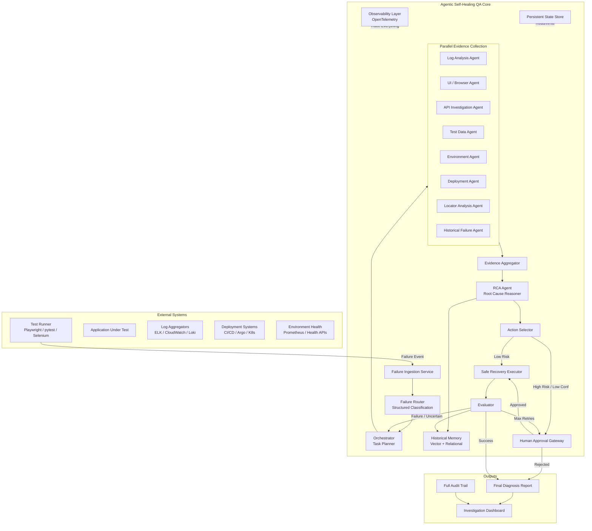

# 4. High-Level Architecture

## 4.1 Conceptual Architecture

## 4.2 Layered View

| Layer                  | Responsibility                                                                 | Key Technologies                  |
|------------------------|--------------------------------------------------------------------------------|-----------------------------------|
| Ingestion              | Receive and normalize test failure events                                      | FastAPI, Event schemas            |
| Classification         | Structured failure typing with confidence                                      | LLM + Structured Output           |
| Orchestration          | Decide which investigation tasks are needed                                    | LangGraph Orchestrator            |
| Investigation          | Parallel specialized evidence collection                                       | Specialized Agents + Tools        |
| Reasoning              | Multi-evidence RCA with Fact/Observation/Inference separation                  | RCA Agent                         |
| Decision               | Select recovery action based on risk, confidence, and policy                   | Action Selector                   |
| Execution              | Perform only permitted recovery actions                                        | Safe Recovery Executor            |
| Validation             | Determine if recovery succeeded and original failure is resolved               | Evaluator                         |
| Knowledge              | Store and retrieve historical failures & resolutions                           | PostgreSQL + pgvector             |
| Control                | Human approval, bounds enforcement, escalation                                 | HITL Gateway + Policy Engine      |
| Observability          | Full tracing, metrics, cost, confidence tracking                               | OpenTelemetry                     |

## 4.3 Key Architectural Decisions

1. **LangGraph as the orchestration backbone** — provides explicit graph structure, persistent state, checkpointing, and human-in-the-loop interrupts.
2. **Specialized agents with least-privilege tools** — no single agent has access to all tools.
3. **Structured outputs everywhere critical** — routing, RCA, action proposals never rely on free-form text alone.
4. **Evidence-first design** — RCA is forbidden from making unsupported claims.
5. **Bounded loops by construction** — investigation depth, retries, and recovery attempts are hard limits in state.
6. **Separation of Diagnosis and Action** — the system can always stop at diagnosis if recovery risk is unacceptable.
