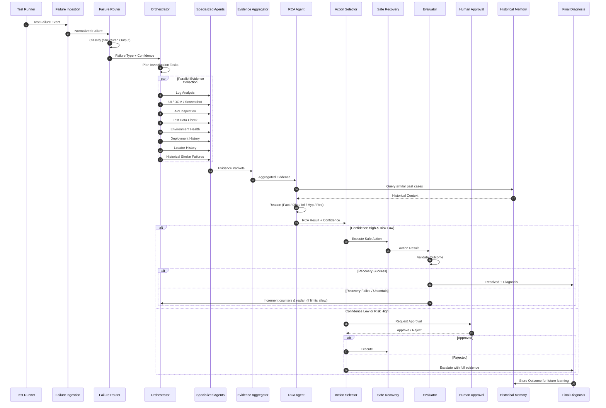
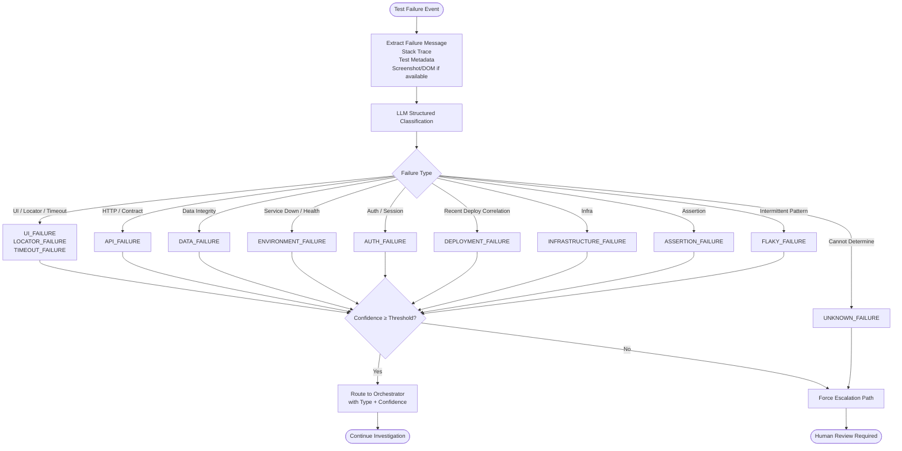
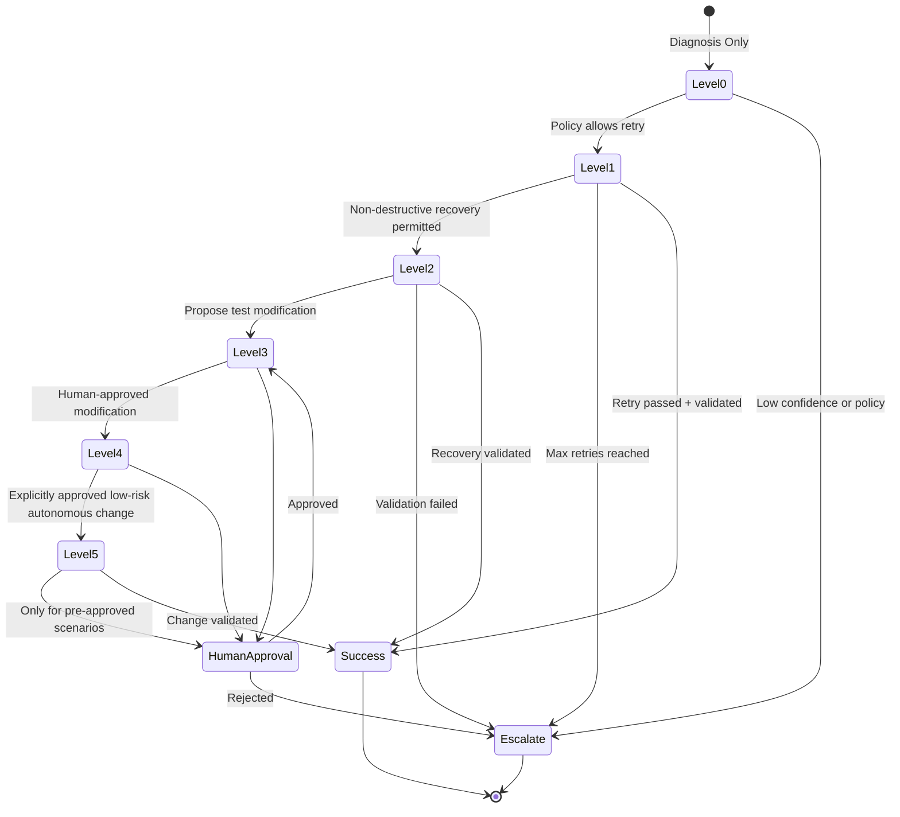
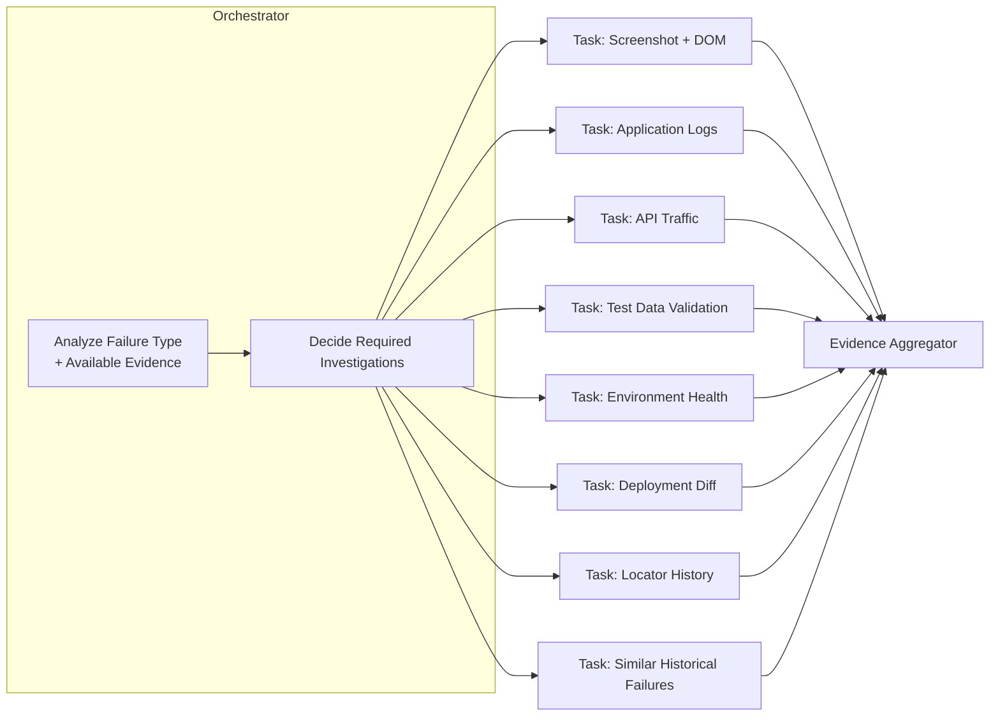
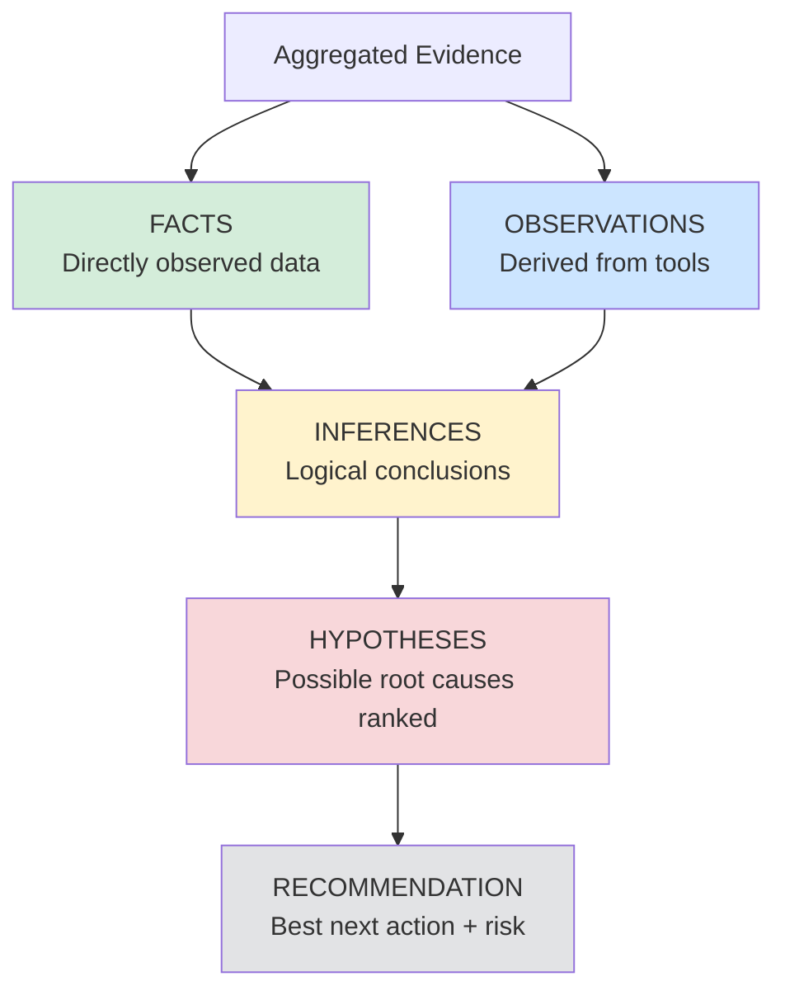
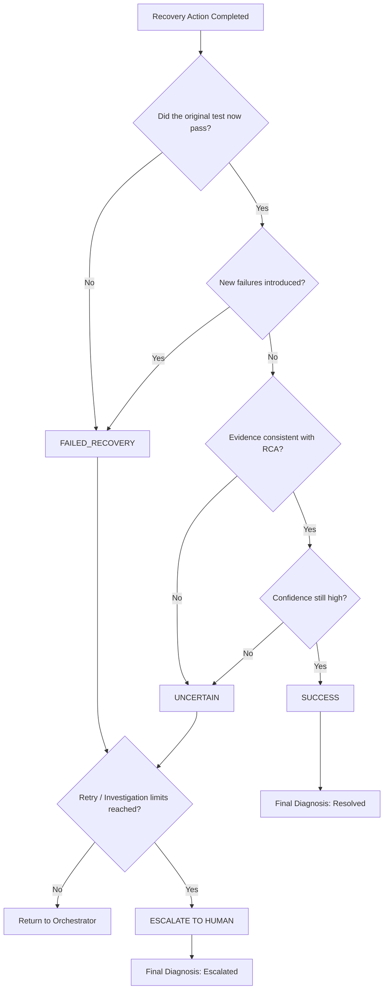
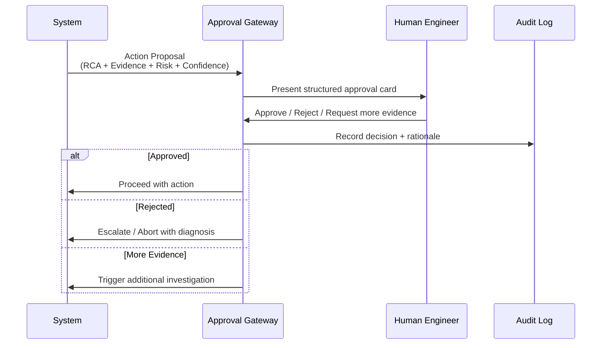

# 5. Core Workflows & Advanced Flow Diagrams

## 5.1 End-to-End Investigation Flow (Primary Sequence)

## 5.2 Failure Router Decision Flow

## 5.3 Self-Healing Levels (Safety State Machine)

**Level Definitions**

| Level | Name                          | Autonomy                          | Typical Actions                              | Risk     |
|-------|-------------------------------|-----------------------------------|----------------------------------------------|----------|
| 0     | Diagnosis Only                | None                              | Produce RCA + evidence report                | None     |
| 1     | Safe Retry                    | Fully autonomous                  | Retry test, wait-and-retry                   | Very Low |
| 2     | Non-destructive Recovery      | Fully autonomous (bounded)        | Refresh session, re-fetch test data, clear cache | Low  |
| 3     | Propose Test Modification     | Proposal only                     | Suggest new locator / assertion change       | Medium   |
| 4     | Human-Approved Modification   | Requires explicit approval        | Apply locator update, data fix               | Medium-High |
| 5     | Fully Autonomous (Restricted) | Only pre-approved low-risk cases  | Explicitly allowed auto-fixes                | Controlled |

## 5.4 Orchestrator Parallel Task Planning

## 5.5 RCA Reasoning Structure (Mandatory Separation)

The RCA Agent is **forbidden** from presenting an Inference or Hypothesis as a Fact.

## 5.6 Evaluator Decision Flow

## 5.7 Human-in-the-Loop Approval Flow

